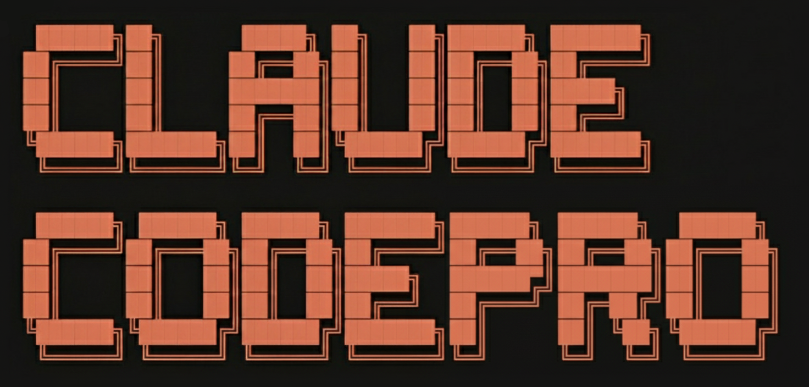

<div align="center">



### Production-Grade Development Environment for Claude Code

TDD enforced. Quality automated. Ship with confidence. 🚀

[](https://github.com/maxritter/claude-codepro/releases)
[](https://github.com/maxritter/claude-codepro/stargazers)
[](https://github.com/maxritter/claude-codepro/commits/main)
[](https://github.com/maxritter/claude-codepro/pulls)


#### ⭐ [Star this repository](https://github.com/maxritter/claude-codepro) · 🌐 [Visit the website](https://claude-code.pro) · 💼 [Follow for updates](https://www.linkedin.com/in/rittermax/) · ✉️ [Get in touch](mailto:mail@maxritter.net)

<br>


</div>

---

## ⚡ TL;DR

```bash
curl -fsSL https://raw.githubusercontent.com/maxritter/claude-codepro/v4.5.25/install.sh | bash
```

Then run `ccp` and `/setup` once. That's it.

---

## 📑 Table of Contents

- [Getting Started](#-getting-started)
- [What's Inside](#-whats-inside)
- [Why Claude CodePro?](#-why-claude-codepro)
- [Usage](#-usage)
- [Contributing](#-contributing)
- [License](#-license)
- [Acknowledgments](#-acknowledgments)

---

## 🚀 Getting Started

### Prerequisites

Choose your installation method:

**Option A: 🐳 Dev Container (Recommended - All Platforms)**
- **Container Runtime** - [Docker Desktop](https://www.docker.com/products/docker-desktop) or compatible equivalent
- **IDE** - [VS Code](https://code.visualstudio.com/), [Cursor](https://cursor.sh/), or [Windsurf](https://codeium.com/windsurf)
- **Dev Containers extension** - [Install from Marketplace](https://marketplace.visualstudio.com/items?itemName=ms-vscode-remote.remote-containers)
- Works on **macOS**, **Linux**, and **Windows (with WSL2)**

**Option B: 🍺 Local Installation (Only macOS/Linux)**
- **macOS or Linux** - Homebrew-compatible system
- **Homebrew** - Installed automatically if not present

**Claude Subscription:** Claude Max 5x/20x or Enterprise recommended for best experience.

### Installation

Run the following command in your **project folder root**:

```bash
curl -fsSL https://raw.githubusercontent.com/maxritter/claude-codepro/v4.5.25/install.sh | bash
```

You'll be asked to choose between **Dev Container** or **Local Installation**.

---

## 📦 What's Inside

### ♾️ Endless Mode

- **Seamless Continuity** - Work on complex features across multiple sessions without losing progress
- **Automatic Handoffs** - Context Monitor detects limits and continues seamlessly in new sessions
- **Persistent Memory** - Relevant observations automatically carry across all sessions
- **Works Everywhere** - Both `/spec` workflow and Quick Mode benefit from session continuity

### 📋 Spec-Driven Development

- **Planning** - Creates a detailed implementation plan for your review as markdown in `docs/plans/`
- **Approval** - You review, edit if needed, and approve the plan before implementation
- **Implementation** - Executes the plan with TDD enforcement and context management
- **Verification** - Runs tests, quality checks, and validates completion based on the plan

### 📚 Modular Rules System

- **Standard Rules** - Best-Practices for TDD, Context Management, etc. in `.claude/rules/standard/`
- **Custom Rules** - Project-specific rules in `.claude/rules/custom/` (never touched by updates)
- **Command Skills** - Workflow-specific modes: `/spec`, `/setup`, `/plan`, `/implement`, `/verify`
- **Standards Skills** - Best-Practices for Frontend, Backend, Testing, etc. automatically injected

### 🧠 Enhanced Context Capabilities

- **Persistent Memory** - Cross-session memory system that automatically ingests context
- **Vexor** - Local vector store based semantic code search for token-efficient retrieval
- **Context7 / Firecrawl** - External context retrieval for code and web search / scraping
- **agent-browser** - Headless browser automation and testing within the Dev Container

### ✅ Quality Hooks Automation

- **Python Quality** - Post-edit hook for ruff, basedpyright and Python LSP server (optional)
- **TypeScript Quality** - Post-edit hook for eslint, tsc, prettier and TypeScript LSP server (optional)
- **General Quality** - Post-edit hook using QLTY for all languages for automated formatting and checking
- **TDD Enforcer** - Pre-edit hook that warns when modifying code without failing tests first

### 🛠️ One-Command Installer

- **Automated Container Setup** - Isolated Linux environment with pre-configured tools and extensions
- **Extended Language Support** - Optionally install extended support for Python & TypeScript
- **Automated Updater** - Updates CCP to the latest version when launched over the binary
- **Shell Integration** - Auto-configures bash, fish and zsh with `ccp` alias


---

## 🔄 Why Claude CodePro?

Same task. Different results.

| Ad-hoc Prompting | With Claude CodePro |
|------------------|---------------------|
| ❌ Writes code without tests | ✅ TDD enforced — tests first, then implementation |
| ❌ No quality checks | ✅ Auto-formatted, linted, type-checked on every edit |
| ❌ Inconsistent workflow | ✅ Structured Plan → Implement → Verify cycle |
| ❌ Context lost between sessions | ✅ Persistent memory carries observations forward |
| ❌ No codebase awareness | ✅ Semantic search understands your code |
| ❌ Hope it works | ✅ Verified before marked complete |

**The result:** Production-grade code you can ship with confidence. Systematic. Tested. Verified.


---

## ⚡ Usage

### First Time Setup

Run `/setup` once to initialize project context and semantic search:

```bash
ccp
> /setup
```

This is independent of which development mode you use - both modes benefit from the initialized context.

### Two Modes of Development

Claude CodePro supports two development modes:

| Mode | Command | Best For |
|------|---------|----------|
| **Spec-Driven** | `/spec "task"` | New features, major changes, complex work |
| **Quick Mode** | Just chat | Quick fixes, bug fixes, small changes |

#### Spec-Driven Mode (`/spec`)

For structured development with planning and verification:

```bash
ccp
> /spec "Describe your feature as detailed as possible"
```

**The workflow:**

```
📋 Plan  →  ✅ Approve  →  🔨 Implement  →  🔍 Verify
                                ↑              ↓
                                └── 🔄 Loop ───┘
```

1. **📋 Plan** - Explores codebase, asks questions, generates detailed spec in `docs/plans/`
2. **✅ Approve** - You review, edit if needed, and approve the plan
3. **🔨 Implement** - Executes tasks with TDD enforcement and quality hooks
4. **🔍 Verify** - Runs tests, quality checks, validates completion (loops back if issues found)

Use this mode when you want a spec to review before implementation, or when the task is complex enough to benefit from structured planning.

#### Quick Mode

For quick work without a spec:

```bash
ccp
> Fix the null pointer bug in user.py
> Add a loading spinner to the submit button
```

Just describe what you need - no plan file, no approval gate. Claude CodePro still provides all the quality hooks, TDD enforcement, and context capabilities. Perfect for bug fixes, small improvements, and exploratory work.

### Customizing Rules

Claude CodePro uses [Claude Code's modular rules](https://code.claude.com/docs/en/memory#modular-rules-with-claude/rules/):

- **Standard Rules** in `.claude/rules/standard/` - Best-Practices updated on install, don't modify those
- **Custom Rules** in `.claude/rules/custom/` - Your project-specific rules, never touched by updates


---

## 🤝 Contributing

**Pull Requests** - New features, improvements, and bug fixes are welcome. Open a PR to contribute.

**Issues** - Found a bug or have a feature request? [Open an issue](https://github.com/maxritter/claude-codepro/issues).

---

## 📄 License

This project is dual-licensed. See the [LICENSE](LICENSE) file for details.

**Free (AGPL-3.0)** - Personal use, students, educators, nonprofits, and open source projects.

**Commercial License** - For proprietary or closed-source projects, [purchase a license](https://license.claude-code.pro).
